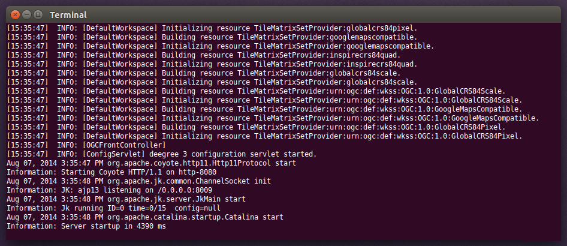

^^^^^^^^^^^^^^^^^^^^^^^^^^^^^^^^^^^^^^^^^^^^
Check the resource status and error messages
^^^^^^^^^^^^^^^^^^^^^^^^^^^^^^^^^^^^^^^^^^^^

As pointed out in :ref:`anchor-console-errors`, the service console indicates errors if resources cannot be initialized. Here's an example:

.. figure:: ../../images/console_error3.png
    :figwidth: 80%
    :width: 70%
    :target: ../../_images/console_error3.png

    Error message

In this case, it was not possible to initialize the JDBC connection (and the resources that depend on it). You can spot resource categories and resources that have errors easily, as they have a red exclamation mark. Click on the respective resource level and on "Errors" near the broken resource to see the error message. After fixing the error, click on "Reload" to re-initialize the workspace. If your fix was successful, the exclamation mark will be gone.

Additional information can be found in the deegree log. If you're running the ZIP version, switch to the terminal window. When initializing workspace resources, information on every resource will be logged, along with error messages.

    Log messages in the deegree log

.. tip::
    If you deployed the WAR version, the location of the deegree log depends on your web application container. For Tomcat, you will find it in file ``catalina.out`` in the ``log/`` directory.

.. tip::
    More logging can be activated by adjusting file ``log4j.properties`` in the ``/WEB-INF/classes/`` directory of the deegree webapplication.
