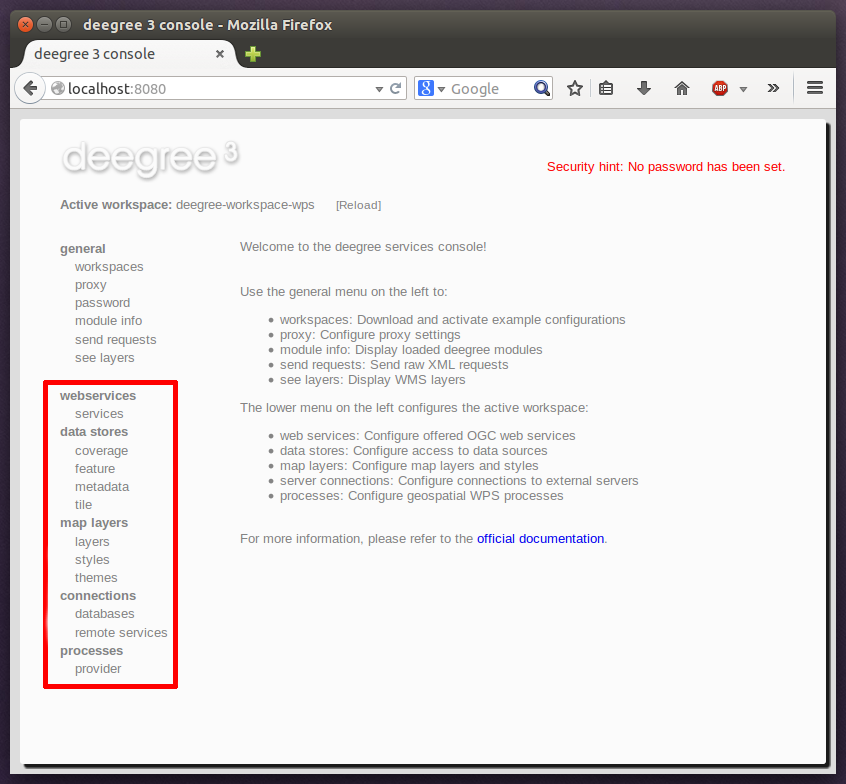

------------------------------------------------
Using the service console for managing resources
------------------------------------------------

As an alternative to dealing with the workspace resource configuration files directly on the filesystem, you can also use the service console for this task. The service console has a corresponding menu entry for every type of workspace resource. All resource menu entries are grouped in the lower menu on the left:

    Workspace resource menu entries

    Although the console offers additional functionality for some resource types, the basic management of resources is always identical.

^^^^^^^^^^^^^^^^^^^^^^^^^^^^^^^
Displaying configured resources
^^^^^^^^^^^^^^^^^^^^^^^^^^^^^^^

In order to display the configured workspace resources of a certain type, click on the corresponding menu entry. The following screenshot shows the metadata store resources in deegree-workspace-csw:

.. figure:: ../../images/console_metadata_stores.png
    :figwidth: 80%
    :width: 70%
    :target: ../../_images/console_metadata_stores.png

    Displaying metadata store resources

    The right part of the window displays a table with all configured metadata store resources. In this case, the workspace contains a single resource with identifier "iso19115" which is in status "On".
