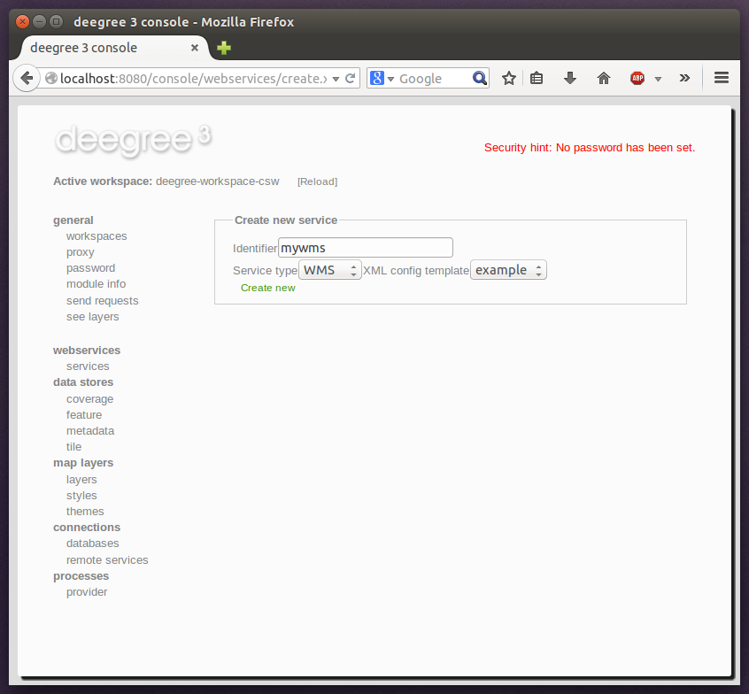

^^^^^^^^^^^^^^^^^^^^^^^
Creating a new resource
^^^^^^^^^^^^^^^^^^^^^^^

In order to add a new resource, enter a new identifier in the text field, select a resource sub-type from the drop-down and click on "Create new":

    Adding a WMS resource with identifier "mywms"

The next steps depend on the type of resource, but generally you have to choose between different options and the result will be a new resource configuration file in the workspace.
