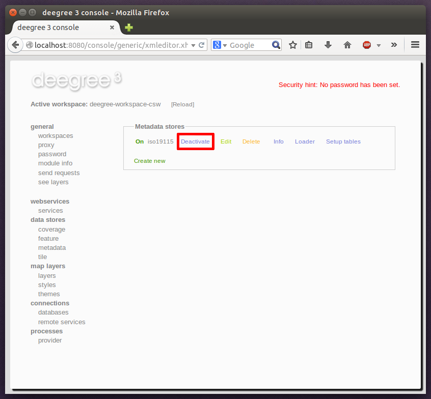

^^^^^^^^^^^^^^^^^^^^^^^
Deactivating a resource
^^^^^^^^^^^^^^^^^^^^^^^

The "Deactivate" link allows to turn off a resource temporarily (while keeping the configuration):

    Deactivate action

    After clicking on "Deactivate", the status of the resource will be "Off", and the "Deactivate" link will change to "Activate". Also, the "Reload" link at the top will turn red to notify that there may be changes that need to be propagated to dependent resources:

.. figure:: ../../images/console_deactivated.png
    :figwidth: 80%
    :width: 70%
    :target: ../../_images/console_deactivated.png

    Deactivated a resource

.. tip::
    When a resource is being deactivated, the suffix of the corresponding configuration file is changed to ".ignore". Reactivating changes the suffix back to ".xml".
