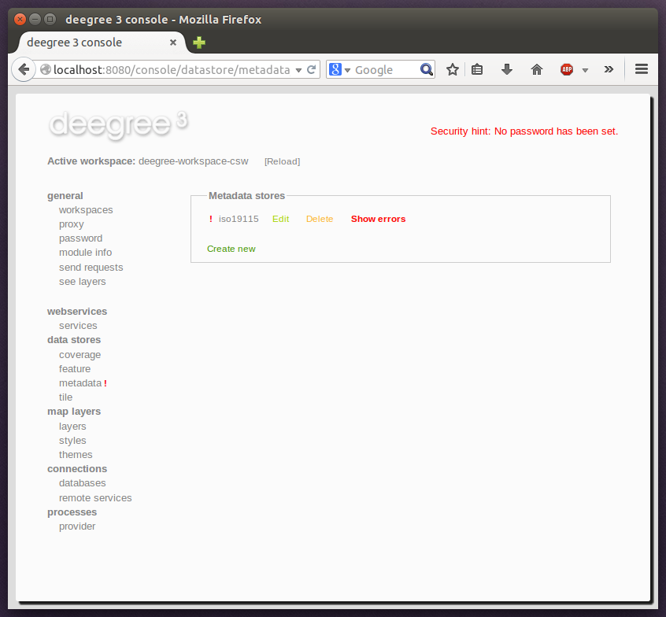
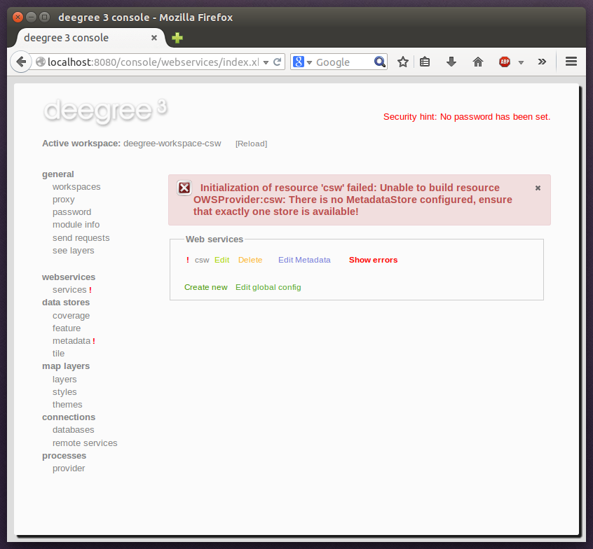

.. _anchor-console-errors:

^^^^^^^^^^^^^^^^^^^^^^^^^
Displaying error messages
^^^^^^^^^^^^^^^^^^^^^^^^^

One of the most helpful features of the console is that it can help to detect and fix errors in a workspace setup. For example, if you delete (or deactivate) JDBC connection "conn1" in deegree-workspace-csw and click "[Reload]", you will see the following:

.. figure:: ../../images/console_error.png
    :figwidth: 80%
    :width: 70%
    :target: ../../_images/console_error.png

    Errors in resource categories

The red exclamation marks near "services" and "metadata" show that these resource categories have resources with errors. Let's click on the metadata link to see what's going on:

    Resource "iso19115" has an error

The metadata resource view reveals that the metadata store "iso19115" has an error. Clicking on "Show errors" leads to:

.. figure:: ../../images/console_error3.png
    :figwidth: 80%
    :width: 70%
    :target: ../../_images/console_error3.png

    Details on the problem with "iso19115"

The error message gives an important hint: "No JDBC connection pool with id 'conn1' defined." deegree was unable to initialize the metadata store, because it refers to a JDBC connection pool "conn1". You may wonder what the error in the services category is about:

    Details on the problem with "csw"

As you see, the problem with the service resource ("There is no MetadataStore configured, ensure that exactly one store is available!) is actually a consequence of the other issue. Because deegree couldn't initialize the metadata store, it was also unable to start up the CSW correctly. If you add a new JDBC connection "conn1" and click on "[Reload]", both problems should disappear.
