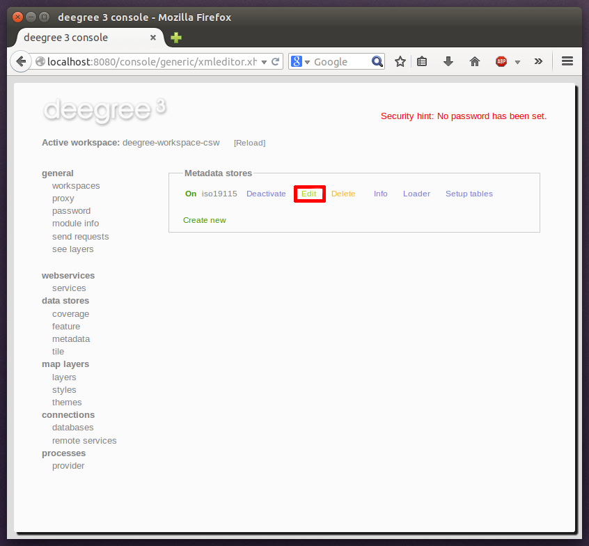

^^^^^^^^^^^^^^^^^^
Editing a resource
^^^^^^^^^^^^^^^^^^

By clicking on the "Edit" link, you can edit the corresponding XML configuration inside your browser:

    Edit action

The XML configuration will be displayed:

.. figure:: ../../images/console_editing.png
    :figwidth: 80%
    :width: 70%
    :target: ../../_images/console_editing.png

    Editing a resource configuration

You can now perform configuration changes in the text area and click on "Save". Or click any of the links:

    * Display Schema: Displays the XML schema file for the resource configuration format.
    * Cancel: Discards any changes.
    * Turn on highlighting: Perform syntax highlighting.

If there are no (syntactical) errors in the configuration, the "Save" link will take you back to the corresponding resource view. Before actually saving the file, the service console will perform an XML validation of the file and display any syntactical errors:

    Displaying a syntax error

In this case, the mandatory "JDBCConnId" element was removed, which violates the configuration schema. This needs to be corrected, before "Save" will actually save the file to the workspace directory.
