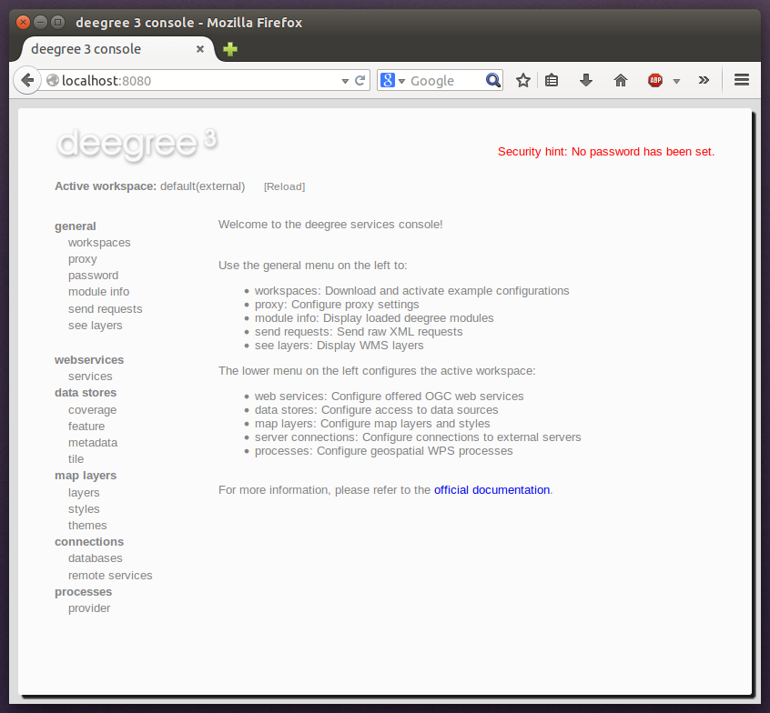
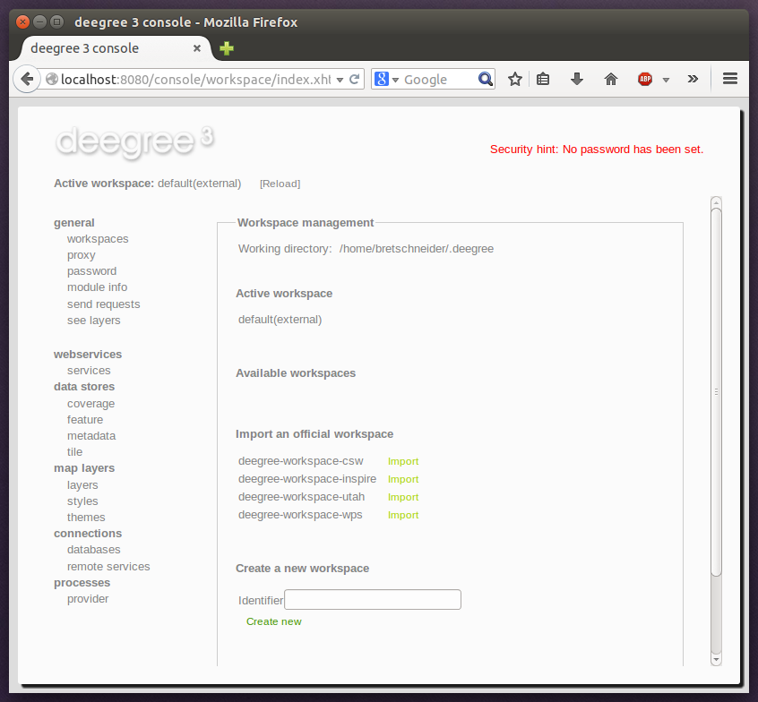
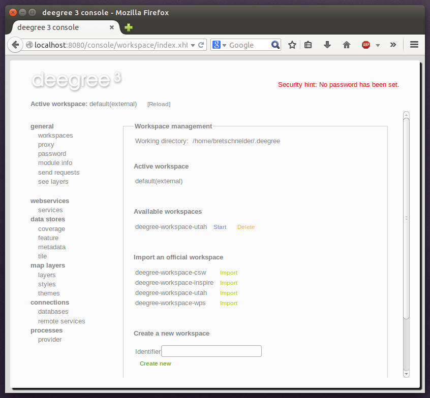

.. _anchor-getting-started:

===============
Getting started
===============

In the previous chapter, you learned how to install and start deegree webservices. In this chapter, we will introduce the deegree service console and learn how to use it to perform basic tasks such as downloading and activating example configurations. In deegree terminology, a complete configuration for a deegree instance is called "deegree workspace".

The following chapters describe the structure and the aspects of the deegree workspace in detail. For the remainder of this chapter, just think of a deegree workspace as a directory of configuration files that contains a complete configuration for a deegree webservice instance. You may have multiple deegree workspaces on your machine, but only a single workspace can be active.

-----------------------------------
Accessing deegree's service console
-----------------------------------

The service console is a web-based administration interface for configuring your deegree webservices installation. If deegree webservices are running on your machine, you can usually access the console from your browser via http://localhost:8080

    deegree webservices administration console

.. tip::
    If you're not running the ZIP version, but deployed the WAR version into a web container, you most probably will have to use a different URL for accessing the console, e.g. http://localhost:8080/deegree-webservices-${project.version}. The port number and webapp name depend on your installation/deployment details.

.. tip::
    You can access the service console from other machines on your network by exchanging *localhost* with the name or IP address of the machine that runs deegree webservices.

For the remainder of the chapter, only the **general** section is relevant. The menu items in this section:

    * **workspaces**: Download and activate example configurations
    * **proxy**: Configure network proxy settings
    * **password**: Set a password for accessing the service console
    * **module info**: Display loaded deegree modules
    * **send requests**: Send raw OGC web service requests
    * **see layers**: Display WMS layers

.. _anchor-downloading-workspaces:

---------------------------------------------
Downloading and activating example workspaces
---------------------------------------------

Click the **workspaces** link on the left:

    Workspaces view

The bottom of the workspaces view lists example workspaces provided by the deegree project. You should see the following items:

    * **deegree-workspace-inspire**: :ref:`anchor-workspace-inspire`
    * **deegree-workspace-utah**: :ref:`anchor-workspace-utah`
    * **deegree-workspace-csw**: :ref:`anchor-workspace-csw`
    * **deegree-workspace-wps**: :ref:`anchor-workspace-wps`

.. tip::
    If the machine running deegree webservices uses a proxy to access the internet and you don't see any available example configurations, you will probably have to configure the proxy settings. Ask your network administrator for details and use the **proxy** link to setup deegree's proxy settings.

If you click **Import**, the corresponding example workspace will be fetched from the artifact repository of the deegree project and extracted in your deegree workspaces folder. Depending on the workspace and your internet connection, this may take a while (the Utah workspace is the largest one and about 70 MB in size).

After downloading has completed, the new workspace will be listed in section "Available workspaces":

    Downloaded, but inactive workspace

You can now activate the downloaded workspace by clicking **Start**. Again, this may take a bit, as it may require some initialization. The workspace will be removed from the list of inactive workspaces and displayed next to "Active workspace:" (below the deegree logo). Your deegree instance is now running the configuration that is contained in the downloaded workspace.

.. toctree::
    :glob:
    :maxdepth: 2

    workspace-inspire/index
    workspace-utah/index
    workspace-csw/index
    workspace-wps/index
