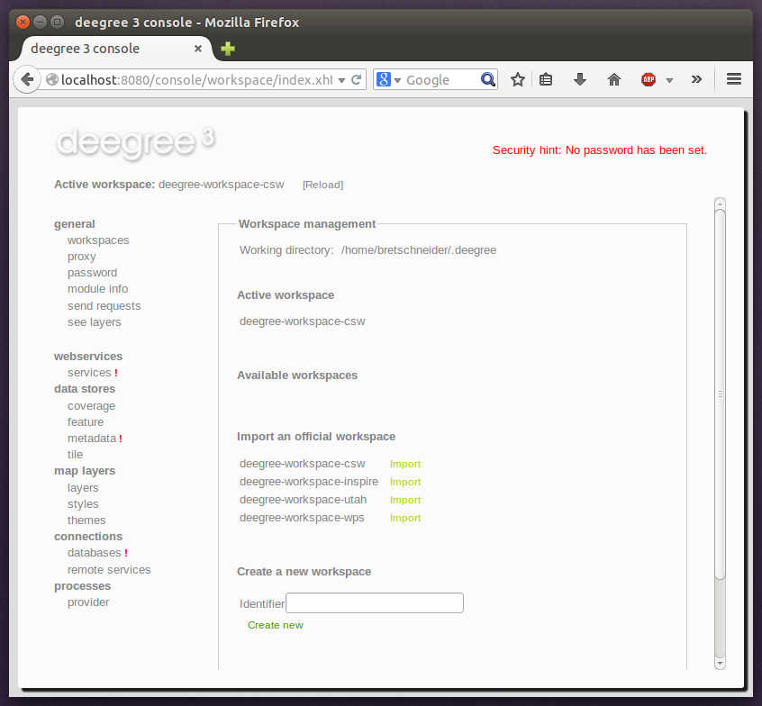

.. _anchor-workspace-csw:

^^^^^^^^^^^^^^^^^^^^^^^^^^^^^^^^^^^^^^^^^^^^^^^^^^^
Example workspace 3: An ISO Catalogue Service setup
^^^^^^^^^^^^^^^^^^^^^^^^^^^^^^^^^^^^^^^^^^^^^^^^^^^

This workspace contains a catalogue service (CSW) setup that complies to the ISO Application Profile. After downloading and starting it, you will have to setup tables in a PostGIS database first. You will need to have an empty and spatially-enabled PostGIS database handy that can be accessed from the machine that runs deegree webservices.

.. tip::
    Instead of PostGIS, you can also use the workspace with an Oracle Spatial or a Microsoft SQL Server database. In order to enable support for these databases, see :ref:`anchor-db-libraries`.

After downloading and starting the workspace, some errors will be indicated (red exclamation marks):

    Initial startup of deegree-workspace-csw

Don't worry, this is just because we're missing the correct connection information to connect to our database. We're going to fix that right away. Click **connections -> databases**:

    JDBC connection view

Click **Edit**:

.. figure:: ../../images/console_workspace_csw3.png
    :figwidth: 80%
    :width: 70%
    :target: ../../_images/console_workspace_csw3.png

    Editing the JDBC resource configuration file

Make sure to enter the correct connection parameters and click **Save**. You should now have a working connection to your database, and the exclamation mark for **conn1** should disappear. Click **Reload** to force a full reinitialization of the workspace:

.. figure:: ../../images/console_workspace_csw4.png
    :figwidth: 80%
    :width: 70%
    :target: ../../_images/console_workspace_csw4.png

    Reinitializing the workspace

The indicated problems are gone now, but we still need to create the required database tables. Change to the metadata store view (**data stores -> metadata**) and click **Setup tables**:

.. figure:: ../../images/console_workspace_csw5.png
    :figwidth: 80%
    :width: 70%
    :target: ../../_images/console_workspace_csw5.png

    Metadata store view

In the next view, click **Execute**:

    Creating tables for storing ISO metadata records

.. figure:: ../../images/console_workspace_csw7.png
    :figwidth: 80%
    :width: 70%
    :target: ../../_images/console_workspace_csw7.png

    After table creation

If all went well, you should now have a working, but empty CSW setup. You can connect to the CSW with compliant clients or use the **send requests** link to send raw CSW requests to the service. The workspace comes with some suitable example requests. Use the third drop-down menu to select an example request. Entry **complex_insert.xml** can be used to insert some ISO example records using a CSW transaction request:

    Choosing example requests

Click **Send**. After successful insertion, some records have been inserted into the CSW (respectively the database). You may want to explore other example requests as well, e.g. for retrieving records:

    Other example CSW requests
