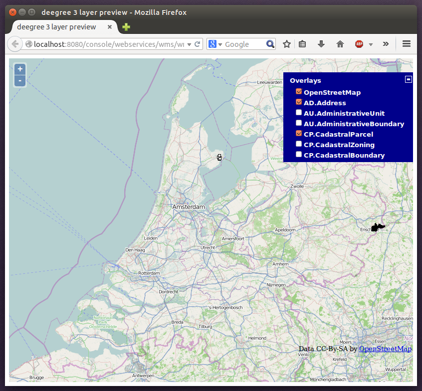

.. _anchor-workspace-inspire:

^^^^^^^^^^^^^^^^^^^^^^^^^^^^^^^^^^^^^^^^^^^^^
Example workspace 1: INSPIRE Network Services
^^^^^^^^^^^^^^^^^^^^^^^^^^^^^^^^^^^^^^^^^^^^^

This workspace is a basic INSPIRE View and Download Services setup. It contains a transactional WFS (2.0.0 and 1.1.0) configured for all Annex I Data Themes and a WMS (1.3.0 and 1.1.1) that is configured for three layers from three Annex I Data Themes. The workspace contains some harmonized dutch base data for Administrative Units, Cadastral Parcels and Addresses. The WFS is configured to behave as an INSPIRE Download service (Direct Access) that delivers the base data as valid, harmonized INSPIRE GML and supports rich querying facilities.

.. tip::
    This workspace is pre-configured to load harmonized INSPIRE features from GML files into memory, but can easily be adapted to use PostGIS, Oracle Spatial or Microsoft SQL Server databases as storage backend (see :ref:`anchor-mapping-wizard` and :ref:`anchor-configuration-sqlfeaturestore`).

After downloading and activating the "deegree-workspace-inspire" workspace, you can click the **see layers** link, which opens a simple map client that displays a base map (not rendered by deegree, but loaded from the OpenStreetMap servers).

.. figure:: ../../images/console_workspace_inspire1.png
    :figwidth: 80%
    :width: 70%
    :target: ../../_images/console_workspace_inspire1.png

    Map client showing base map

Click the **+** on the right to see a list of available layers. You can now tick the INSPIRE layers offered by the deegree WMS.

.. figure:: ../../images/console_workspace_inspire2.png
    :figwidth: 80%
    :width: 70%
    :target: ../../_images/console_workspace_inspire2.png

    INSPIRE layers rendered by the deegree WMS

.. tip::
    The map client is based on `OpenLayers <http://openlayers.org/>`_. Drag the map by holding the mouse button and moving your mouse. Zoom using the controls on the left or with the mouse wheel. Alternatively, you can open a zoom rectangle by holding the SHIFT key and clicking the mouse button in the map area.

Note that nothing will be rendered for layer AD.Address, as the configured storage (memory) doesn't contain any Address features yet. However, the workspace ships with example WFS-T requests that can be used to insert a few harmonized INSPIRE Address features. Use the **send requests** link in the service console to access the example requests (you may need to go back in your browser first):

Use the third drop-down menu to select an example request. Entries **Insert_200.xml** or **Insert_110.xml** can be used to insert a small number of INSPIRE Address features using WFS-T insert requests:

.. figure:: ../../images/console_workspace_inspire3.png
    :figwidth: 80%
    :width: 70%
    :target: ../../_images/console_workspace_inspire3.png

    WFS-T example requests

Click **Send** to execute the request. After successful insertion, the internal storage contains a few addresses, and you may want to move back to the layer overview (**see layers**). If you activate layer AD.Address this time, the newly inserted features will be rendered by the deegree WMS (look for them in the area of Enkhuizen):

    Ad.Address layer after insertion of example Address features

The example requests also contain a lot of query examples, e.g. requesting of INSPIRE Addresses by street name:

.. figure:: ../../images/console_workspace_inspire5.png
    :figwidth: 80%
    :width: 70%
    :target: ../../_images/console_workspace_inspire5.png

    WFS query examples

.. tip::
    This workspace is a good starting point for implementing scalable and compliant INSPIRE View and/or Download Services. It can easily be adapted to use PostGIS, Oracle Spatial or Microsoft SQL Server databases as storage backend (see :ref:`anchor-mapping-wizard` and :ref:`anchor-configuration-sqlfeaturestore`). Other things you may want to adapt is the configuration of :ref:`anchor-configuration-layers`, the :ref:`anchor-configuration-renderstyles` or the reported :ref:`anchor-configuration-service-metadata`.

.. tip::
    You can also delete features using WFS transactions. After deletion, they will not be rendered anymore as WMS and WFS operate on the same feature store.
