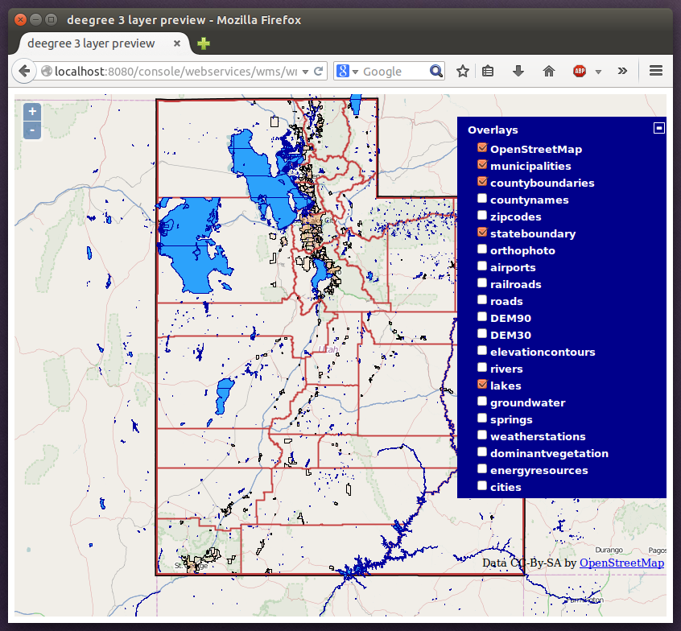
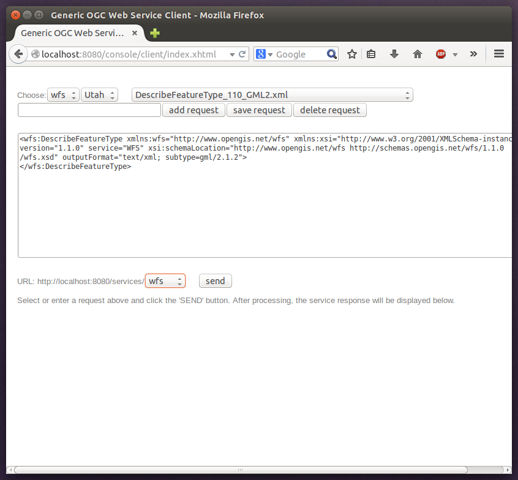

.. _anchor-workspace-utah:

^^^^^^^^^^^^^^^^^^^^^^^^^^^^^^^^^^^^^^^^^^^^^
Example workspace 2: Utah Webmapping Services
^^^^^^^^^^^^^^^^^^^^^^^^^^^^^^^^^^^^^^^^^^^^^

The Utah example workspace contains a web mapping setup based on data from the state of Utah. It contains a WMS configuration (1.3.0 and 1.1.1) with some raster and vector layers and some nice render styles. Raster data is read from GeoTIFF files, vector data is backed by shapefiles. Additionally, a WFS (2.0.0, 1.1.0 and 1.0.0) is configured that allows to access the raw vector data in GML format.

After downloading and activating the "deegree-workspace-utah" workspace, you can click on the **see layers** link, which opens a simple map client that displays a base map (not rendered by deegree, but loaded from the OpenStreetMap servers).

.. figure:: ../../images/console_workspace_utah1.png
    :figwidth: 80%
    :width: 70%
    :target: ../../_images/console_workspace_utah1.png

    Map client showing base map

Click the **+** on the right to see a list of available layers. Tick the ones you want to see. They will be rendered by your deegree webservices instance.

    Selecting WMS layers to be displayed

.. tip::
    The map client is based on `OpenLayers <http://openlayers.org/>`_. Drag the map by holding the mouse button and moving your mouse. Zoom using the controls on the left or with the mouse wheel. Alternatively, you can open a zoom rectangle by holding the SHIFT key and clicking the mouse button in the map area.

.. figure:: ../../images/console_workspace_utah3.png
    :figwidth: 80%
    :width: 70%
    :target: ../../_images/console_workspace_utah3.png

    Exploring Utah layers

In order to send requests against the WFS, you may use the **send requests** link in the service console (you may need to go back in your browser first). A simple interface for sending XML requests will open up. This interface is meant for accessing OGC web services on the protocol level and contains some reasonable example requests.

    Sending example requests

Select one of the example requests from the third drop-down menu and click **Send**. The server response will be displayed in the lower section.

.. figure:: ../../images/console_workspace_utah5.png
    :figwidth: 80%
    :width: 70%
    :target: ../../_images/console_workspace_utah5.png

    Sending example requests

.. tip::
    WFS request types and their format are specified in the `OGC Web Feature Service specification <http://www.opengeospatial.org/standards/wfs>`_.

.. tip::
    Instead of using the built-in layer preview or the generic OGC client, you may use any compliant OGC client for accessing the WMS and WFS. Successfully tested desktop clients include Quantum GIS (install WFS plugin for accessing WFS), uDig, OpenJUMP and deegree iGeoDesktop. The service address to enter in your client is: http://localhost:8080/services.

.. figure:: ../../images/qgis_workspace_utah.png
    :figwidth: 80%
    :width: 70%
    :target: ../../_images/qgis_workspace_utah.png

    Quantum GIS displaying a WMS layer from the Utah workspace
