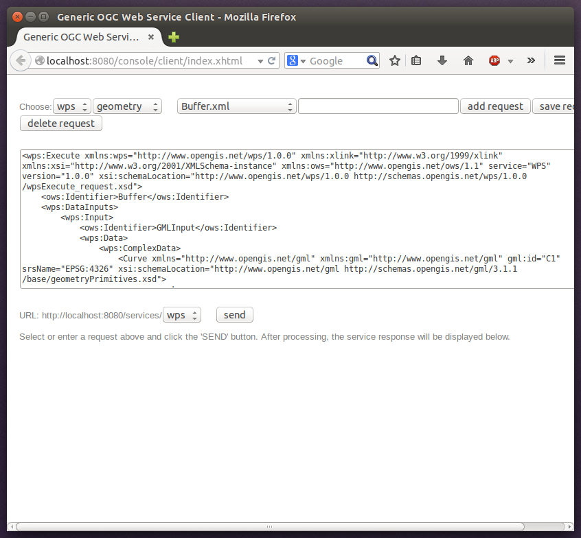

.. _anchor-workspace-wps:

^^^^^^^^^^^^^^^^^^^^^^^^^^^^^^^^^^^^^^^^^^^^^^^^
Example workspace 4: Web Processing Service demo
^^^^^^^^^^^^^^^^^^^^^^^^^^^^^^^^^^^^^^^^^^^^^^^^

This workspace contains a WPS setup with simple example processes and example requests. It's a good starting point for learning the WPS protocol and the development of WPS processes. After downloading and starting it, click **send requests** in order to find example requests that can be sent to the WPS. Use the third drop-down menu to select an example request:

.. figure:: ../../images/console_workspace_wps1.png
    :figwidth: 80%
    :width: 70%
    :target: ../../_images/console_workspace_wps1.png

    Choosing a WPS example request

Click **Send** to fire it against the WPS:

    Sending an example request against the WPS

The response of the WPS will be displayed in the lower section:

.. figure:: ../../images/console_workspace_wps3.png
    :figwidth: 80%
    :width: 70%
    :target: ../../_images/console_workspace_wps3.png

    WPS response is displayed

Besides the geometry example processes, the parameter example process and example requests may be interesting to developers who want to learn development of WPS processes with deegree webservices:

.. figure:: ../../images/console_workspace_wps4.png
    :figwidth: 80%
    :width: 70%
    :target: ../../_images/console_workspace_wps4.png

    Example requests for the parameter demo process

The process has four input parameters (literal, bounding box, xml and binary) that are simply piped to four corresponding output parameters. There's practically no process logic, but the included example requests demonstrate many of the possibilities of the WPS protocol:

    * Input parameter passing variants (inline vs. by reference)
    * Output parameter handling (inline vs. by reference)
    * Response variants (ResponseDocument vs. RawData)
    * Storing of response documents
    * Asynchronous execution

.. figure:: ../../images/console_workspace_wps5.png
    :figwidth: 80%
    :width: 70%
    :target: ../../_images/console_workspace_wps5.png

    Example requests for the ParameterDemo process

.. tip::
    WPS request types and their format are specified in the `OGC Web Processing Service specification <http://www.opengeospatial.org/standards/wps>`_.

.. tip::
    In order to add your own processes, see :ref:`anchor-configuration-wps` and :ref:`anchor-configuration-processproviders`.
